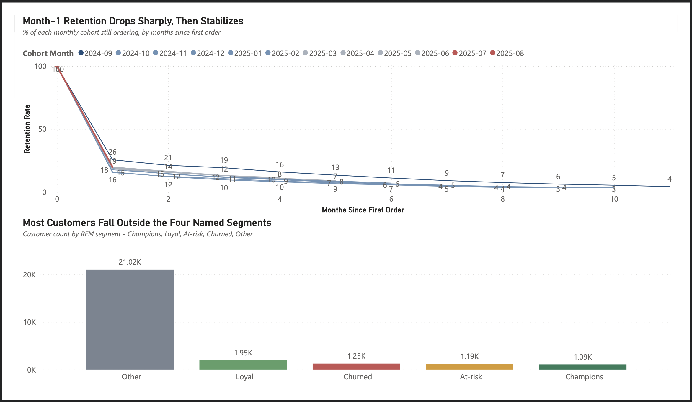
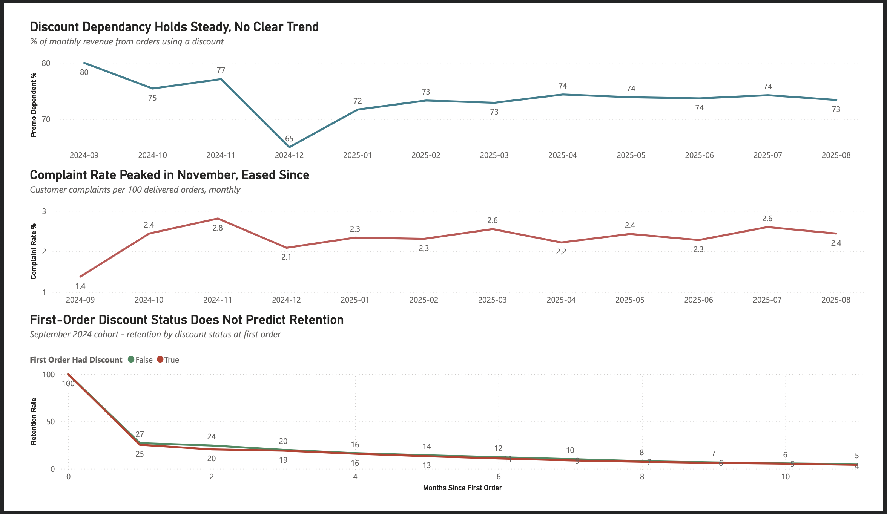
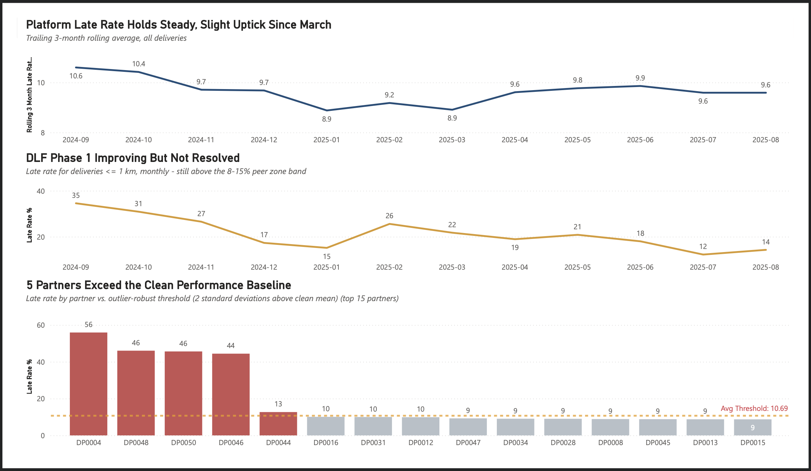
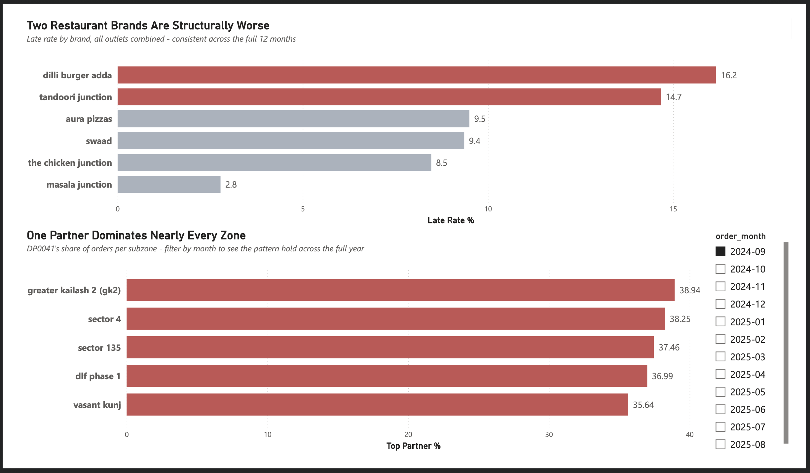

# Food Delivery Analytics — End-to-End SQL Project

A simulated data-warehouse engagement for a food delivery platform, built on **real order data** (21,321 orders, Delhi NCR, Sep 2024–Jan 2025, extended to 48,864 orders / 12 months) with a documented synthetic delivery-ops layer, run for two stakeholders end to end: business objective → data cleaning → diagnosis → root cause → quantified recommendation → ongoing KPIs.

**Stack:** Snowflake → **migrated to PostgreSQL** (trial expiry) · dbt (staging models, Snowflake-era) · Python (synthetic data generation) · Power BI (dashboard, in progress)

📄 **[Full Project Charter (PDF)](docs/Food_Delivery_Project_Charter.pdf)** — stakeholder briefs, every finding, Amazon Leadership Principles mapping, and the general analysis framework used throughout.

**⚠️ Note on `sql/` vs `postgres_sql/`:** the project started on Snowflake (`sql/`) and was migrated to Postgres (`postgres_sql/`) after the Snowflake trial expired. Both are kept — the migration itself is a legitimate part of the project, demonstrating translation of Snowflake-specific syntax (`COUNT_IF`→`FILTER(WHERE...)`, `SELECT * EXCLUDE()`→explicit columns, `DATEDIFF()`→manual `EXTRACT` math) with every query cross-verified against the original results. **`postgres_sql/` is the current, actively maintained version**, running on the full 12-month extended dataset.

---

## The two stakeholders

| | Priya Nair — Head of Retention & Growth | Arjun Mehta — Head of Delivery Operations |
|---|---|---|
| **Objective** | Build a customer base that stays because they love the service, not the discount | Make on-time delivery a promise customers can rely on |
| **Techniques** | Cohort retention, RFM segmentation, look-ahead-bias correction, threshold sensitivity testing | Root-cause breakdown, counterfactual impact projection, 2-SD outlier detection with self-contamination check, confound control |
| **Headline finding** | Discount status at first order does **not** predict retention — an earlier version showing it did was traced to look-ahead bias and discarded | DP0041 handles 30–45% of orders in nearly every zone, every month, for a full year — a platform-wide resilience risk, not an isolated issue |

## Dashboard Preview

Live-connected Power BI dashboard (DirectQuery → Supabase), 4 pages, 12 visuals total.

### Retention & Growth — Diagnostics


### Retention & Growth — Trends


### Delivery Operations — Health


### Delivery Operations — Root Cause & Risk



## Findings Summary

| Finding | Key Number | Status |
|---|---|---|
| Month-1 retention drop | 25.59% → 15.36% (Sep–Dec cohorts) | 📉 Real, confirmed trend |
| Discount status at first order → retention | 1–5pp gap, inconsistent direction | ✅ No meaningful effect |
| Promo-dependent revenue share | 38–53% (threshold-sensitive range) | ⚠️ Report as range, not a point estimate |
| Revenue concentration within promo segment | Top 10% of spenders = 30.78% of segment revenue | ⚠️ Concentrated, not broad-based |
| RFM segments (12-month) | Other 21.0K · Loyal 1.9K · Churned 1.2K · At-risk 1.2K · Champions 1.1K | ℹ️ Snapshot, re-check quarterly |
| Restaurant brand late rate | dilli burger adda 16.2% · tandoori junction 14.7% vs. 2.8–9.5% others | 🚨 Unresolved, brand-wide, 12 months |
| Partner outlier detection | 4 partners at 44–56% late; 5th (DP0044) at 12.68% | 🚨 Escalate 4 · 👁️ Watch 1 |
| DLF Phase 1 short-distance late rate | 34.55% → 12–14% (Sep–Aug) | ⚠️ Improving, not resolved |
| Partner concentration (DP0041) | 35–39% share in 70+ of 76 zone-months | 🚨 Highest-urgency finding in project |
| Shahdara zone concern | Small-sample noise (19 of 22 month-bands low-volume) | ✅ Resolved — no action needed |

## What's actually interesting here (not just what's in the tables)

- **A wrong finding was caught and corrected in public.** The first version of the promo-dependency analysis showed a large, clean gap — it was wrong, built on a look-ahead bias (using future orders to explain past retention). The corrected version is in the repo, with the discarded version documented as a lesson, not hidden.
- **A statistical detection method was stress-tested against itself.** The 4 flagged delivery partners could theoretically be inflating the very baseline used to detect them — so the baseline was recomputed excluding them, and they still failed the stricter threshold. Re-run independently across 12 separate months, they failed every single time.
- **A dataset extension revealed its own limitation.** Extending from 5 to 12 months of data corrected one right-censoring diagnosis (proving a decline was real) and *created* a new, documented one (a KPI that only works at day-level granularity broke on month-level simulated data) — both are written up as findings, not swept under the rug.

## Repo structure

```
sql/               Snowflake-era analysis queries (original, 5-month dataset)
postgres_sql/      CURRENT — Postgres translations, verified, 12-month dataset.
                   Includes migration notes + 2 findings that only surfaced with
                   more data: DP0044 (resolved — persistent mild outlier, added
                   to watch list) and shahdara (resolved — small-sample noise,
                   no action needed). File 07 documents the view→table
                   materialization fix and every marts view behind the dashboard.
scripts/           Python: synthetic data generation (reproducible, seeded) + Snowflake DDL
data/              Source CSVs (raw + 12-month extension batch)
docs/              Data dictionary (what's real vs. synthetic, and why) + full project charter
dashboard_previews/ Screenshots of all 4 live Power BI dashboard pages
models/            dbt staging models (Snowflake-era, kept for reference)
```
```

## Data note

The order data is real. The delivery-partner identity, SLA promise, and lateness outcome are **fully synthetic** — the source export has no partner-level data at all — built to make Arjun's questions answerable in a way the raw data doesn't support. Every synthetic assumption is documented in [`docs/DATA_DICTIONARY.md`](docs/DATA_DICTIONARY.md), including which of the injected data-quality issues were deliberate (dedup, casing, mixed date formats, orphaned keys) vs. real.

## Status

Both stakeholders' full analysis, findings, and ongoing KPI dashboards are complete (13 KPIs total), migrated and re-verified on Postgres after the Snowflake trial expired. Two new findings emerged from the 12-month extension and are under active investigation: a possible 5th outlier delivery partner (DP0044) and a possible emerging zone issue (shahdara). Power BI dashboard in progress (Snowflake connection previously proven via DirectQuery; reconnecting to Postgres).
